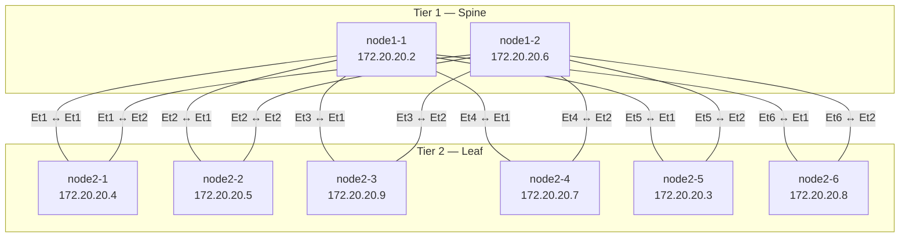

# EOS MCP Server — Example Prompts

These examples show how to interact with the EOS MCP server through Claude. All examples are drawn from a real cEOSLab testlab session.

---

## Setup

### Add the MCP server from `.mcp.json`

Place a `.mcp.json` file in your project directory — Claude Code auto-discovers it without any import command:

```json
{
  "mcpServers": {
    "eos": {
      "command": "eos-mcp-server",
      "args": [
        "serve",
        "--inventory",
        "./ansible-inventory.yml"
      ],
      "env": {
        "EOS_MCP_PASSWORD": "replace-with-device-password"
      }
    }
  }
}
```

---

## Inventory

### List all devices and groups

> What devices are in the inventory?

> List the inventory

### Check connectivity to all devices

> Probe all the EOS devices in inventory

Example output: 8/8 devices reachable, showing hostname, endpoint IP, and EOS version.

---

## Device Facts

### Collect facts across the entire fabric

> Get facts for all the EOS devices

Returns model, EOS version, serial number, uptime, and system MAC for every host.

---

## Topology

### Generate a topology diagram from LLDP

> Create a topology diagram for all the devices using LLDP neighbors

Claude queries `show lldp neighbors` across all devices, infers the topology, and renders a Mermaid diagram. Example output for a 2-tier spine-leaf lab:



---

## VXLAN

### Check VXLAN status across all leaf switches

> Check on the VXLAN status for all the leaf switches

Claude runs `show vxlan vtep`, `show vxlan vni`, and `show interfaces Vxlan1` and summarizes:

- VTEP source IP and interface per leaf
- VNI-to-VLAN mappings
- Replication mode (headend VCS vs multicast)
- Flood list membership
- Interface line protocol status

### Example findings

```
node2-1  VTEP 192.168.2.3  Loopback1  VNI 1100 → VLAN 100  up
node2-2  VTEP 192.168.2.4  Loopback1  VNI 1100 → VLAN 100  up
node2-3  VTEP 192.168.2.5  Loopback1  VNI 1100 → VLAN 100  up
node2-4  VTEP 192.168.2.6  Loopback1  VNI 1100 → VLAN 100  up
node2-5  VTEP 192.168.2.7  Loopback1  VNI 1100 → VLAN 100  up
node2-6  VTEP 192.168.2.8  Loopback1  VNI 1100 → VLAN 100  up
```

---

## BGP EVPN

### Check EVPN session and route state

> Check on EVPN

Claude runs `show bgp evpn summary` and `show bgp evpn` across all leaves and summarizes:

- Session state per peer (Established / Idle / etc.)
- Prefixes received and advertised per peer
- EVPN route types present (Type-2 MAC/IP, Type-3 IMET, etc.)
- ECMP path count per remote VTEP
- AS path to identify route reflectors and leaf ASNs

### Example findings

All 6 leaves peered to both spines (AS 65000), each leaf with a unique ASN (65001–65006). Only Type-3 IMET routes present — flood list built from EVPN, dual-path ECMP via both spines confirmed.

---

## VLANs

### Inspect a specific VLAN across all leaves

> What can you tell me about VLAN 100?

Claude runs `show vlan 100`, `show mac address-table vlan 100`, and `show interfaces Vlan100` across all leaves and reports:

- VLAN name and status on each leaf
- Which ports are members (access ports, trunk ports, VXLAN tunnel)
- MAC address table entries (learned hosts)
- Whether an SVI exists and its IP/state

### Example findings

VLAN 100 (`VLAN100`) active on all leaves, member of `Vx1` only, empty MAC table, no SVI — fully provisioned L2 overlay segment with no hosts connected yet.

---

## Available Tools

| Tool | Description |
|---|---|
| `eos_probe_devices` | Validate connectivity, auth, and eAPI reachability |
| `eos_list_inventory` | Show eligible hosts and groups from the loaded inventory |
| `eos_get_facts` | Collect model, version, serial, uptime, system MAC |
| `eos_get_running_config` | Retrieve running config (full for hosts, section for groups) |
| `eos_run_show` | Run arbitrary `show ...` commands; returns JSON or text |
| `eos_get_server_info` | Show server capabilities, runtime mode, inventory summary |
